# Intro to DBMS

## Objectives:
* Design Process
* Modeling
* Constraints
* E-R Diagram
* Weak Entity Sets
* Design Issues
* Extended E-R Features
* ER Design Examples

---

## 1 - Design Process
* Use a flow chart to map a database (with ERDs) 
---

## 2 - Modeling
Set Type | Description |Example
-|-|-
`Entity set` | set of entities of the same type that share the same properties |E.g. 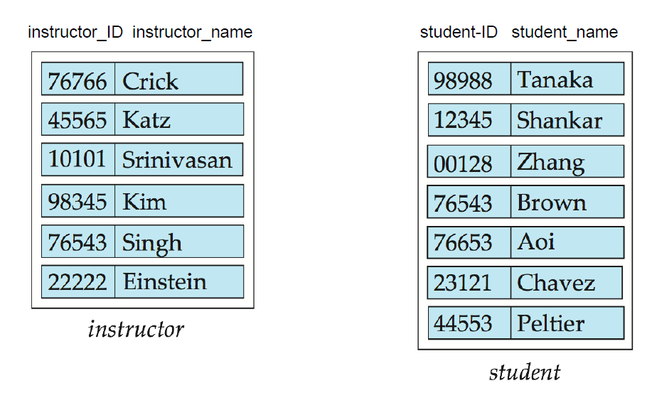 

### Relationships between Tables

Relationship Type | Description |Example
-|-|-
`binary relationship`| only two entity sets related | instructor teaches class
`Non-binary relationship`| More than two entity sets related | Student on a project who is taught by a instructor

### Attribute Tables
* `Domain`: the set of *permitted* values for each attribute

Attribute type | DEfinition | Example
-|-|-
`Simple attribute`|composed of only one part  | a student
`Composite attribute` | composed of several subparts | first, middle, last name
`Single-valued attribute` | has only one value |first name
`Multivalued attribute` | has multiple values | phone_numbers, student_degree
`Derived attribute` | Computed from other attributes |Age, given DoB
---

## 3 - Constraints (Keys and Ref. Integrity)
Key Type | Definition
-|-
`Super key`     | ***Multiple*** attributes whose values uniquely determine each entity.
`Candidate key` | ***Minimal*** super keys. Note several candidate keys may exist
`Primary key`   | ***one of the candidate keys*** is selected to be the primary key

---

## 4 - `ERDs` (*Entity Relationship Diagram*)

### Overview
ER Type | Explanation
-|-
ER `Model`    | design tool describing at the high level data and relationships among data
ER `Diagram`  | Relationships among data

### Basic `Constraints`
Basic Relationships | Example
-|-
Basic Notation          |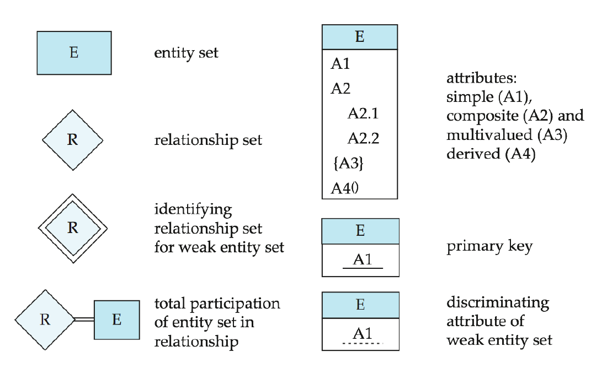 
Relationship Notation   |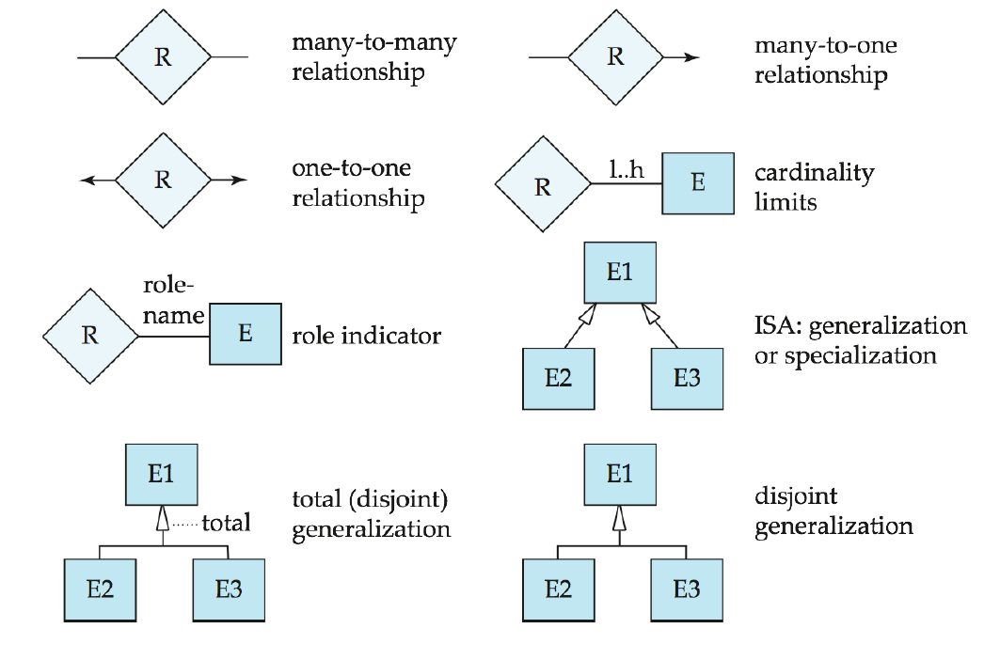 
Alternative Entities    |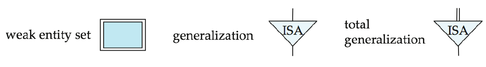 
Alternative Relationship|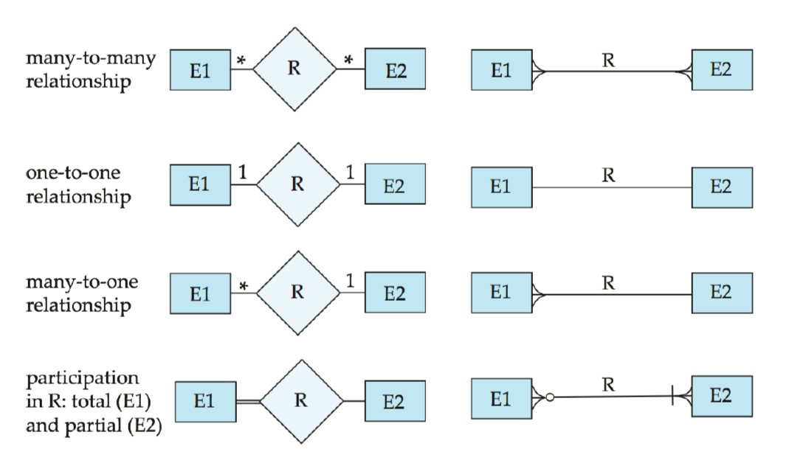 

 

### Extended  `Constraints`
Relationship | Description | Example 
-|-|-
`Role Indicator` |course could be a prereq, or it could be a main course |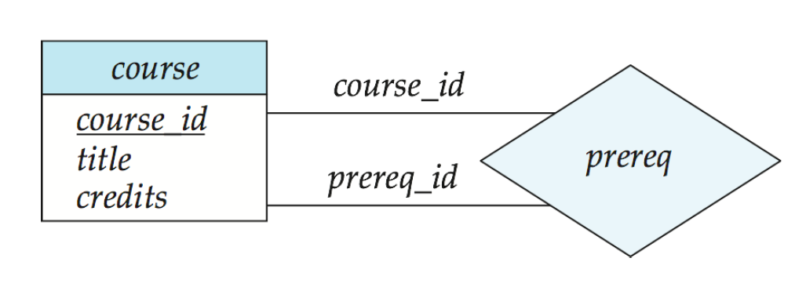 
Extended `min to max constraints`| min and max amount of relationships in entity set |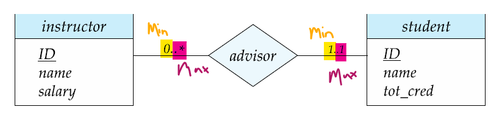 
`Ternary` Notation | Multiple entities in relation |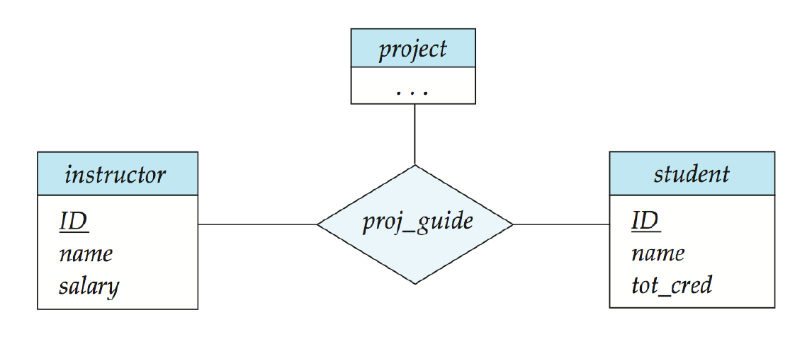 

---

## 6 - Weak Entity Sets
> Entity set that does not have a primary key is a `weak entity set`

Set|Description|Example
-|-|-
`Identifying Relationship` | How a strong entity set relates to a weak one
`Discriminator`            | Set of attributes that act like an identifier

  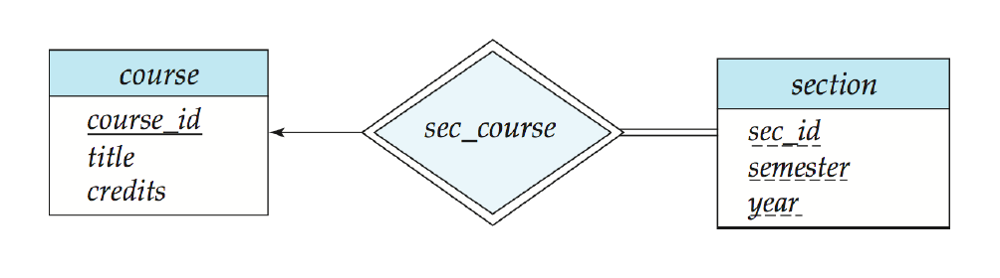

---

## 5 - Design Issues (*Considerations*)
Question | Recomendation | Example
-|-|-
Should you use a `full entity set`, *or* create an `attribute table`? | Attribute if you need additional info with a variable | 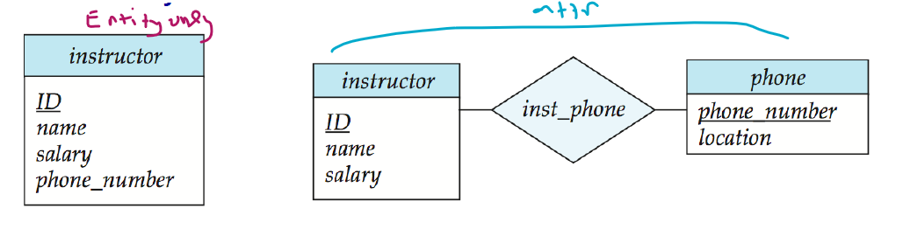
Should you use `entity sets` vs. `relationship set`? | If the set describes an action, then you could do relationshpip set.
How do you conquer `redundant attributes`? Like department. | Create dept ID attached to entity set. | 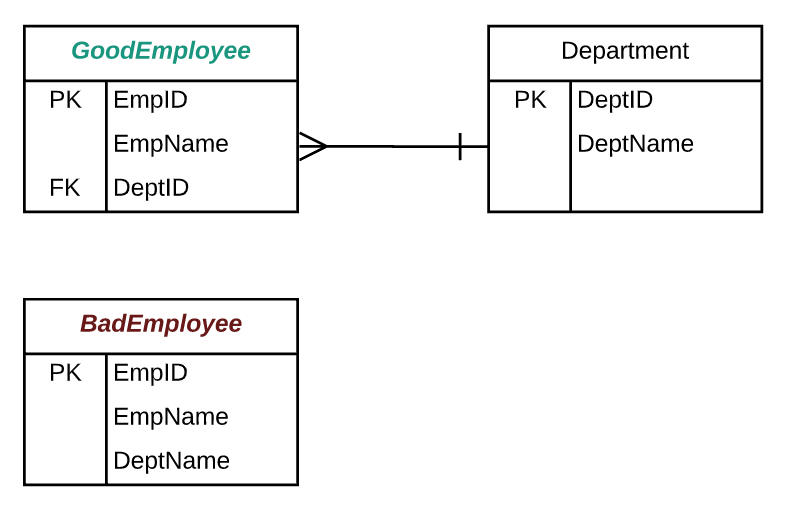
When should you use `binary` or `n-binary relationship set?`| Use if it can better express a relationship. | 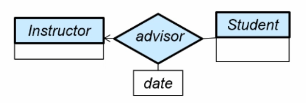

---

## 7 - Extended E-R Features
E-R Feature | Description | Example
-|-|-
`Specialization` | Order ERD from top down (sub-class, super-class relationship) | 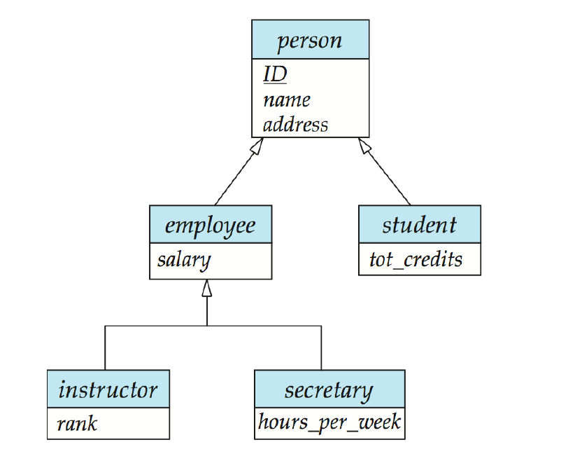
`Generalization` | Multiple entity sets into a single one

### Specialization/Generalization Relationships (Sub-class and super-class relations)
Relation Type | Description of Constraint
-|-
`Disjoint` | An entity ONLY belongs to ***one*** lower-level entity
`Overlapping` | An entity belongs to ***multiple***  lower-level entity

### Aggregation of Information
* Multiple entities may have similar records, so aggregate in seperate entity

    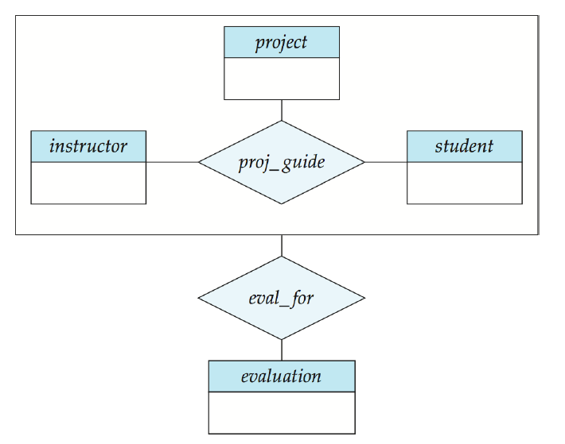
---

## 8 - ER Design Examples

