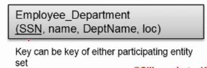
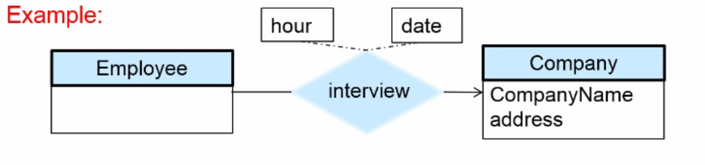
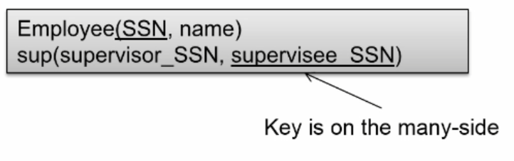

# Relational Model

## Objectives:
1. Relational Model
2. Converting an ER diagram to relation schemas

---
 
## 1. Relational Model

* Difference between ER and Relational model:
    * ER: Model
    * Relational Model: Implementation

### Relations
> A relation is a table

Term | Description
-|-
`Attribute`   | Column 
`Tuple`       | Row

### Attribute Types
Type    | Description
--------|-------------
Domain  | Allowed values in attribute (*exception: `null` values*)
Atomic  | Indivisible, attributes are normally indivisible

### Relation Schemas and Instances
Type        | Description
------------|-------------
Schema      | instructor
Attributes  | ID, name, dept_name, salary

*Written Form:*
```
instructor (ID, name, dept_name, salary)
```

### Keys
> 1. Get set of `candidate` keys (which is a unique) from a set of `superkeys`
> 2. Select ***one*** `candidate` key to be the `primary key`

---

## 2. Converting an ER diagram to relation schemas

* Relational Database houses relational schemas
* A relational schema houses entity and relationship set 

### Example of `Schema` Conversions
Explanation         | Example   | Conversion
--------------------|-----------|--------
`Simple` Attribute  |  | 
`Composite` Attribute |  | 
`Multivalued` Attribute |  | Use Instructor ID as key and give phone number. 

### Example of `ER` Conversions
Explanation         | Example   | Conversion
--------------------|-----------|--------
`Many-to-Many`  |  | 
`One-to-One` (*Basic*)  |  | 
`One-to-One` (*Dept has Total Participation*)  |  | 
`One-to-One` (*Each have Total Participation*)  |  | 
`One-to-Many` |  | Create seperate schema to join the two:  
`One-to-Many` |  | Or just add the dept ID in as a FK:  
`Relationship w/Attributes` (*I.e. employee on multiple dates*)  |  | 

### Advanced Conversions

Explanation         | Example   | Conversion
--------------------|-----------|--------
`Weak to Strong`|  | No need for relation, just include course as `PK`: 
`Disjoint Total`|  | Don't create two schemas, just one since inherits same info: 
`Disjoint Partial`|  | Needs three schemas since some employees could be other: 
`Aggregation`|  | Needs three schemas since some employees could be other: 
`Recursive`|  | Needs three schemas since some employees could be other: 

### Schema Diagram
> Shows the relationships between `primary` and `foreign` keys
* Arrows show relationship of IDs, not the relationship of one-to-many, etc.

