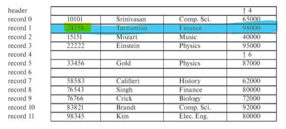

# File Organization

## Objectives:
1. How to represent records in a file structure
2. How to organize records in a file: different file organizations
    * Heap Files
    * Sequential Files
    * Indexed Sequential Files
    * B-Tree Index Files
    * B+-Tree Index Files
    * Multiple-Key Access Using Indices
    * Static Hashing
    * Dynamic Hashing
    * Comparison of Ordered Indexing and Hashing
    * Multi-table Clustering File Organization
3. Index Definition in SQL
4. Factors Considered in Deciding a File Organization for a Table
5. Data Dictionary Storage

---

## Resources
* [All data structures and visualization calculator](https://www.cs.usfca.edu/~galles/visualization/Algorithms.html)
* [B Tree Insertion/Deletion Calculator](https://www.cs.usfca.edu/~galles/visualization/BTree.html)
* [B+ Tree Insertion/Deletion Calculator](https://www.cs.usfca.edu/~galles/visualization/BPlusTree.html)
* [Hash Table Insertion/Deltion Calculator](http://users.csc.calpoly.edu/~jdalbey/103/Lectures/HashtableCalc.html)

---
<br>

## `1` - How to ***represent*** records in a `file structure`

### 1.1 - How to Represent Records in a File Structure
Object      | Stored as
------------|------------
Database    | Collection of `files`
File        | Collection of `records`
Record      | Collection of `fields`

---

### 1.2 - `Fixed-Length Records`
1. Assume record is `fixed-length` of same `type`
2. Each file (table) has records of one particular type only
3. Different files (tables) used for different relations

#### Two Main `Fixed-Length Storages`:
1. `Fixed-Length Tables`
2. `Free Lists`

--- 

#### Example of  `insertion` w/`Fixed Length Files`

0. Base Table
<br> 

1. Insert `(24556, Turnamian, Finance, 98000)`, search key left col
<br> 


#### Methods of `deletion` w/`Fixed Length Files`
Method                      | Description
----------------------------|-------------
Delete and Move up          | Delete and the `next` record goes in its place
Delete and Move Last Record | Delete and the `last` record goes in its place

#### Example of `deletion` w/Fixed Length Files
0. `Base` Table *(Fixed Length File)*
<br> 

1. `Delete` Record (Compact table, i.e. ***row vanishes***) *(Fixed Length File)*
<br> 

2. `Delete` Record and ***move last record in its place*** *(Fixed Length File)*
<br> 

---

#### `Free Lists` and Deleting Records
> Reuse space for normal attributes of free records to store pointers **(efficient space allocation)**

#### Steps to `Free Lists`:
1. Store address of `first deleted record` in `header`
2. First record location stores the address of `second deleted record`
3. Iterate until finally “points” to the `final delteted record`

#### Example of `Free Lists`:


---

### 1.3 - `Variable-Length Records`
* Allowed to have Variable, but user sets to a certain size. 
* E.g. `varchar(20)`, where `20` is *fixed* but `varchar` is *variable*

#### Possible ***uses*** of Variable-Length Records
1. VL records needed when `different field types` in a file (*table*)
2. Field contains objects such as a string that can vary (use `varchar`)
2. Records allow for fields such as `arrays`

#### ***Issues*** of Variable-Length Records
1. Retrieving data from objects like arrays could be tricky within a *`record`*
2. Retrieving data from objects like arrays could be tricky within a *`block`*

#### `Slotted Page Structures` and Variable Length Records
##### Object that contains data related to:
1. Number of entries (chars in a fixed array of chars)
2. Number of free space (chars not used in ^^)
3. Location and size of each record

* Note that pointers point to the entry in the header, not the record
<br> 

---

## `2` - How to ***Organize*** Records in A File: File Organization
> Goal improve query processing time

### 2.0 - What `Factors Help Decide on File Organization for a Table`?
* Types of queries on the table
    * Random search
    * Range search
    * Insertion
    * Deletion
* Frequencies of queries
* Access time
* Insertion time
* Deletion time
* Space overhead

---

### 2.1 - `Heap` Files
> Records inserted at end of file (*table*)

Note    | Description
--------|--------------
`Pros`  | Efficient on ***insertion*** due to no sort
`Cons`  | Slow ***Search*** since linear
`Use`   | Populate a table that you do not know what it is used for later. Change later onve known use.

---

### 2.2 - `Sequential` Files
> Records inserted in file by `search-key order`


Note    | Description
--------|--------------
`Pros`  | If search key is important, then efficient
`Cons`  | Could be slow on insertion since need to find search key then insert
`delete`| Use `pointer chain` (See `Free List` example above)
`insert`| If `free space, then insert`, if not, then insert in `overflow block` (i.e. EOFile). *Will need to reorder file periodically to restore order*

---

### 2.3 - `Indexed Sequential` Files
> File that contains an index and a secondary index that references another file  
> Provides much `faster search`, but has `overhead when updating indices`

* `Example` of Indexed Sequential: Primary index patron ID, and secondary index age bin ID that references another table.

Note    | Description
--------|--------------
`Pros`  | Much faster searching 
`Cons`  | More maintenence, since indexes must be updated each time a table is modified
`Cons 2`| Performance worse as file grows
`Implementation` | Sequential scan with primary keys is efficient, but not with secondary keys.

#### `Dense Index` (*`fast` but `more space allocation`*)
* ID record appears on ***every*** record
<br> 

#### `Sparse Index` (*`slow` but `less space` than `dense index`*)
* ID records for only ***some*** search-key values
<br> 

##### *To locate a record with search-key value `K` we:*
1. Find index record with largest search-key value < K
2. Search file sequentially starting at the record to which the index record points

#### `Sparse + dense` Index `Combo`
* Sparse Index that corresponds to an index in another data block
<br> 

#### `Secondary Indices`
* Buckets that point to all records that fall in that bucket.
* Must be `dense` since each bucket corresponds to a id value 
<br> 

#### `Multilevel Index` (*overcomes main-memory limits*)
* Outer Index = sparse
* Inner index = primary index

Note    | Description
--------|--------------
`Pros`  | If cannot fit primary-index in main memory, then can allocate another index 
`Cons`  | All levels of indices must be updated on `insertion` or `deletion`
`Implementation` | Create primary index, and then create a sparse index on it.

* ID -> ID -> ID . . .
<br> 

---

### 2.4 - `B Tree` Index Files
> Balanced tree of order `N` with at least 2 children
Speed = (n/2) -1 to n  
> *`Works well for insertions and deletions`*

#### `B-Tree` Overview

* Balanced tree 
    - root has >= 2 children
    - leaf or non-leaf has at `least 1 node and max 2 nodes`
* table that stores the indices that points to a a record
* Minimum of 


#### `Insertion` on B-Tree
1. When root is full, split it into 2 nodes at level 1
2. If a non-root node is full, split the node into 2 nodes at the same level
<br> 
<br> 

#### `Deletion` on B-Tree
> Key: must maintain a balanced tree
1. `If` deletion of value in a non-leaf node causes a node to be too small, `then` move the smallest key of the sub-tree pointed to by pointer Pi+1to the place of Ki
2. If Ki is a leaf node, then redistribute the search key values over sibling leaf nodes and adjust the pointers along the path from leaf to root.
<br> 

#### Pros and Cons of `B Trees`

Pros    | Description
--------|--------------
Fewer Nodes | May use fewer nodes than B+ Tree
Search Key Find | Somtimes possible to find search key before reaching leaf nodes 

Cons    | Description
--------|--------------
Slow Finding | Few Keys Found Before leaf node
High Depth   | Non-leaf nodes larger, so depth of tree is high
Complicated Insert/Delete   | More complicated than B+ Tree
Hard Implementation | Harder implementation than B+ Tree

* Note that ***disadvantages usually `greater` than advantages with B Trees***

---


### 2.5 - `B+ Tree` Index Files
> B+ tree that has pointers at leaf node, repeating search keys, and is good for random searching


#### `B+ Tree` Overview
* Balanced tree
* A search key value may appear more than once 
* Data pointers are sored at leaf nodes only 
* Every search key value appears once at the leaf level (`min 1 max 2`)
* Leaf nodes are linked together to facilitate ordered access on search key values
* Efficient for random search and range search

#### `B+ Tree` `Insert`


#### `B+ Tree` `Delete`


---

### 2.6 - `Multiple-Key Access` Using Indices
> Various ways to query based on criteria

Example Multiple-Key Access

For access, multiple ways to process this query:
```SQL
select ID
from instructor
where dept_name = “Finance” and salary= 80000
```
Potential Solutions to Example
1. Search salary bins, then the dept
2. Search department name, then salary bins
3. Query separately then Cross reference each other 

---

### 2.7 - `Static Hashing`
> Use `buckets` to organize files (tables). Access via `hash functions`

Note    | Description
--------|--------------
Bucket  | Bin in which is a search key
Hash-Function   | Some function to obtain hash (search) key. Used for find, insertion, and deletion.
Searching       | Find search key, then search bucket for record(s) needed.

#### ***Pros and Cons*** of `Hash Files`

Question    | Answer
------------|--------------
Are hash tables good for range or random search? | Random, since you search for one specific value (search key)
What is the worst hash function? | When the search keys group way too many records. Sequential searching will be slow. 
Ideal hash function? | Each bucket contains same number of records (either uniformly, or on average).

#### `Bucket Overflows` with `Hash Files`
Question    | Answer
------------|--------------
When does a bucket overflow happen? | When a bucket does not have enough space, so `chain` another bucket to first bucket (see slide).
Deficiencies? | Databases grow overtime, so performance could degrade
Overcome?   | Periodically create new hash function to even out buckets. Optimal for `dynamic` modification of hash function through `extendable hashing`.

---

### 2.8 - `Dynamic Hashing`

#### Extendable Hashing (*Dynamic Hash Function*)
* Extendable Hashing dynamically adjusts the hash function as the database changes in size

Pro / Con   | Description
------------|--------------
Pro         | Performance same with changes in size of db, small storage, and no fixed buckets
Cons        | Key lookup via directory

---

## 3 - Comparison of `Ordered Indexing` and `Hashing`
> `Hashing` preferred with records with `key`  
> `Indexing` preferred for `range` queries

* Re-organization can be costly (I.e. hashing)
* Frequent Insertions and deletions 
* Is average time preferred if it hurts worst case time?

---

## 4 - `Multi-table Clustering` File Organization
>  Join two tables into one rather than having a relation
* Advangtage:   If expected to search on two records (*date and businessID*)
* Disadvantage: If expected to only search on one record (*businessID*)

---

### Index Definition in SQL

#### `Create` Index
```SQL
create index indexName on table(column)
```

#### `Remove` Index
```SQL
drop index indexName
```

---

## 4 - `Data Dictionary` Storage
* Information about `relations`
    * names of relations
    * names, types and lengths of attributes of each relation
    * names and definitions of views
    * integrity constraints
* User and accounting information, including `passwords`
* `Statistical` and `descriptive` data
    * number of tuples in each relation
* Physical `file organization` information
    * How relation is stored (sequential/hash/…)
    * Physical location of relation
* Information about `indices`


